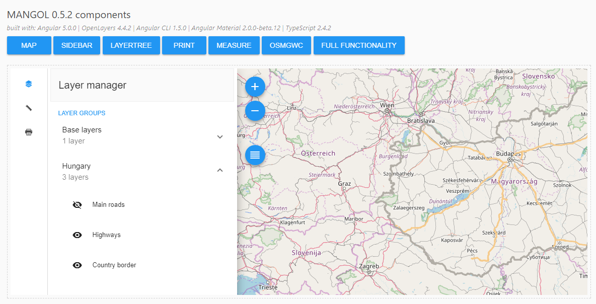

# Mangol

> Maps created with Angular2+ & OpenLayers3+

[](https://gitter.im/mangol_official/Lobby?utm_source=badge&utm_medium=badge&utm_campaign=pr-badge&utm_content=badge)

[](https://david-dm.org/fegyi001/mangol)
[](https://david-dm.org/fegyi001/mangol#info=devDependencies)

## About Mangol

Mangol is an open source library for combining [Angular2+](https://angular.io/) and [OpenLayers3+](https://openlayers.org/) to create modern, responsive interactive web maps (_M_ stands for _maps_, _ang_ for _Angular_ and _ol_ for _OpenLayers_). The project has been created using [@angular/cli](https://cli.angular.io/), a command-line tool for Angular projects (1.5.0). The project is written in TypeScript 2.4.2 and uses SCSS for styling. It has been built with Angular 5.0.0 and OpenLayers 4.4.2 using Angular Material design 2.0.0-beta.12. The packaging is done via [Webpack module bundler](https://webpack.github.io/).

Formerly, Mangol was called `ng2ol3` and was based on SystemJS and without angular-cli.

## Install

[Node.js with npm](https://nodejs.org/en/download/) is required. The preferenced version of Node.js is 8.x.x, the preferenced version of npm is 5.x.x. After `git clone`, navigate to the main directory and run ```npm install``` to download all dependencies.

## Live example

An online example can be opened [here](http://188.166.116.137/mangol).

## Use as source

If you wish to see the built-in demos or modify the source files, simply run ```ng serve``` to load the demo page on ```localhost:4200```. With this command you can also watch file changes until you shut it down.

## Use as npm library

If you would like to use Mangol as an npm library in your Angular2+ (TypeScript) project, you can also do that since [Mangol is on npm](https://www.npmjs.com/package/mangol) as well.

First, add Mangol as a dependency to your project:

```batch
npm install mangol --save
```

You have to add to your `app.module.ts` (or whatever you call it in your project, the one that gets bootstrapped in main.ts)

```typescript
import {MangolModule} from 'mangol';
```

And in @NgModule add MangolModule to the imports:

```typescript
imports: [
    ...,
    MangolModule,
    ...
]
```

It is highly recommended to add some vendor js files. If you use Webpack and created your project with @angular/cli, add the following libraries to your `angular-cli.json`:

```json
"scripts": [
    "../node_modules/openlayers/dist/ol.js",
    "../node_modules/proj4/dist/proj4.js",
    "../node_modules/jspdf/dist/jspdf.min.js"
]
```

If you use SystemJS add the files above in a regular way to your index.html (with script tags).

At the beginning of your main SCSS file, you should import mangol.scss like this:

```scss
@import "~mangol/mangol";
```

After that, you can use Mangol html tags in your templates such as

```html
<mangol></mangol>
```

## Basic example

This is the simplest implementation of Mangol in a component (this will create a default map with zoom buttons and with one OpenStreetMap layer) :

```typescript
import { Component } from '@angular/core';

@Component({
    selector: 'app',
    template: `
      <mangol></mangol>
    `
})
export class AppComponent {

}
```

## Configuring the component

You can further configure your Mangol component for example by adding a sidebar and a layertree like this (for more examples, see the src/app/demos folder):

```typescript
import { Component, OnInit } from '@angular/core';

import * as ol from 'openlayers';

@Component({
  selector: 'app',
  template: `
      <mangol [config]="config"></mangol>
    `
})
export class AppComponent implements OnInit {

  config: any;

  public ngOnInit(): any {
    this.config = {
      map: {
        renderer: 'canvas',
        target: 'mangol-map',
        view: {
          projection: 'EPSG:900913',
          center: ol.proj.fromLonLat([19.39563, 47.16846], 'EPSG:900913'),
          zoom: 7
        },
        layers: [
          {
            type: 'layergroup',
            name: 'Base layers',
            expanded: false,
            visible: true,
            children: [
              {
                type: 'layer',
                name: 'OpenStreetMap layer',
                visible: true,
                opacity: 1,
                layer: new ol.layer.Tile({
                  source: new ol.source.OSM()
                })
              }
            ]
          }
        ]
      },
      sidebar: {
        collapsible: true,
        opened: true,
        toolbar: {
          layertree: {}
        }
      }
    };
  };
}
```

## Styling

Mangol uses Material components and therefore it supports some SCSS customization. For example if you wish to alter the default colors, you can easily do that by overwriting the primary, accent and warn Material palettes <b>before</b> importing mangol.scss. Do it like this:

```scss
@import '~@angular/material/theming';
@include mat-core();
$mangol-primary: mat-palette($mat-teal);
$mangol-accent: mat-palette($mat-lime);
$mangol-warn: mat-palette($mat-deep-orange);
$mangol-theme: mat-light-theme($mangol-primary, $mangol-accent, $mangol-warn);

@import "~mangol/mangol";
```

If you wish to set the component height or the sidebar width, also do it before importing mangol.scss:


```scss
$mangol-height: 400px;
$mangol-sidebar-width: 350px;

@import "~mangol/mangol";
```

## More hooks

In order to reach more functionality, you can access the MangolMapService instance, which stores the map(s) and some helper functions. All you have to do is use the 'mapReady' output on your 'mangol' component. With that you can extend your app quite easily:

```typescript
import { Component } from '@angular/core';

@Component({
  selector: 'app-root',
  template: `<mangol (mapReady)="onMapReady($event)"></mangol>`
})
export class AppComponent {
  title = 'app works!';

  onMapReady($event: any) {
    console.log($event);
  }
}
```

## Present & Future

This project is still very new and therefore it contains only a couple of components (widgets), most of them are under heavy development. In the near future I intend to add/extend other widgets. More examples will arrive as soon as the project becomes smarter.



## Author

```Mangol``` was created and being maintained by [Gergely Padányi-Gulyás](http://gpadanyig.com)
